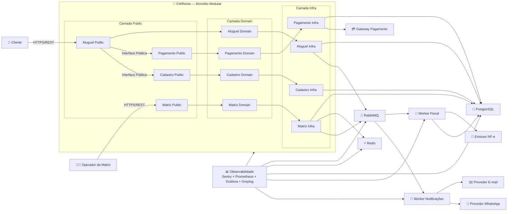

# CWRents — Arquitetura de Software

O CWRents é um sistema de aluguel de veículos projetado inicialmente para atender Curitiba e região metropolitana, com foco em baixo custo operacional, simplicidade de manutenção e possibilidade de expansão futura.

O sistema permite que clientes realizem reservas de veículos, pagamentos e recebam notificações automáticas por e-mail e WhatsApp durante todo o processo de locação. Além disso, a plataforma oferece emissão automática de nota fiscal eletrônica e um módulo administrativo utilizado pela matriz para acompanhamento financeiro e logístico.

A arquitetura foi desenhada pensando em um time pequeno de desenvolvimento, priorizando soluções simples, robustas e de fácil evolução ao longo do tempo.

---

# Objetivos do Projeto

O principal objetivo do CWRents é entregar uma plataforma confiável e financeiramente sustentável para operações regionais de aluguel de veículos, evitando complexidade excessiva logo no início do projeto.

As decisões arquiteturais foram guiadas principalmente pelos seguintes fatores:

* baixo custo de infraestrutura
* facilidade de manutenção
* desempenho das operações principais
* escalabilidade gradual
* independência tecnológica
* simplicidade operacional

---

# Principais Características

* Reserva e aluguel de veículos
* Pagamentos via Pix, cartão e dinheiro
* Emissão automática de nota fiscal
* Notificações via WhatsApp e e-mail
* Relatórios administrativos e financeiros
* Cache distribuído com Redis
* Processamento assíncrono com RabbitMQ
* Observabilidade com ferramentas open source
* Proteção contra abuso de API com rate limiting

---

# Tecnologias Utilizadas

| Tecnologia           | Responsabilidade                  |
| -------------------- | --------------------------------- |
| Python + FastAPI     | APIs e serviços principais        |
| PostgreSQL           | Persistência de dados             |
| RabbitMQ             | Processamento assíncrono          |
| Redis                | Cache distribuído e rate limiting |
| Grafana + Prometheus | Métricas e monitoramento          |
| Graylog              | Centralização de logs             |
| Sentry               | Rastreamento de erros             |

---

# Atributos de Qualidade Priorizados

O projeto prioriza alguns atributos de qualidade considerados essenciais para o contexto do negócio.

## Desempenho

As operações principais do sistema devem responder em até 2 segundos, especialmente consultas operacionais e relatórios frequentemente acessados.

O uso de Redis ajuda a reduzir a carga no banco de dados e melhora significativamente a velocidade de respostas repetitivas.

## Disponibilidade

O sistema foi projetado para minimizar indisponibilidades perceptíveis ao cliente, utilizando serviços gerenciados da AWS e processamento assíncrono para isolar falhas não críticas.

## Manutenibilidade

A arquitetura separa domínio e infraestrutura para facilitar futuras evoluções tecnológicas sem necessidade de reescrever regras de negócio.

Isso permite trocar frameworks, gateways de pagamento ou provedores externos com impacto reduzido.

## Escalabilidade

O sistema foi pensado para crescimento gradual. A arquitetura atual suporta expansão regional sem exigir reescrita completa da aplicação.

## Observabilidade

Logs, métricas e rastreamento de erros são centralizados para facilitar diagnóstico rápido e operação com um time enxuto.

---

# Considerações Finais

O CWRents foi projetado para ser pragmático: simples o suficiente para um time pequeno manter, mas estruturado o bastante para crescer de forma organizada.

A arquitetura evita complexidade desnecessária, mantendo foco em desacoplamento, baixo custo e facilidade de evolução tecnológica.

---

# Fluxo Geral da Arquitetura

